# Visual learning index

Open [index.html](index.html) locally for the searchable gallery and five step-throughs.
The HTML uses local assets and works offline without a server. On GitHub, browse the figures below.

Each numbered figure has an explicit light/dark version, an accessible description and a linked lesson.
Blue identifies the current focus; plain outlines give context. Dashed strokes mark alternatives or invalid choices where labeled.
Figures use the same canonical examples as the Java visual-contract tests. See [design and provenance](design.md) and [verification](verification.md).

## 01. Array insertion: make a gap

[Linear structures: read the lesson](../../data-structures/arrays/operations.md)

<picture><source media="(prefers-color-scheme: dark)" srcset="assets/array-insertion-dark.svg">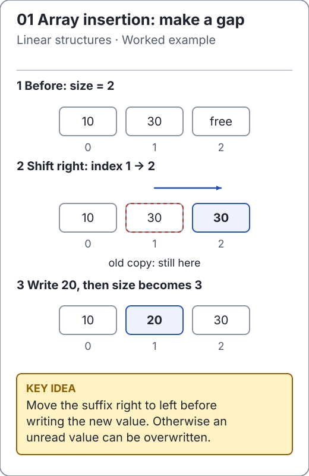</picture>

**Key idea:** Move the suffix right to left before writing the new value. Otherwise an unread value can be overwritten.

## 02. Unlinking a known list node

[Linear structures: read the lesson](../../data-structures/linked-lists/doubly.md)

<picture><source media="(prefers-color-scheme: dark)" srcset="assets/linked-unlink-dark.svg">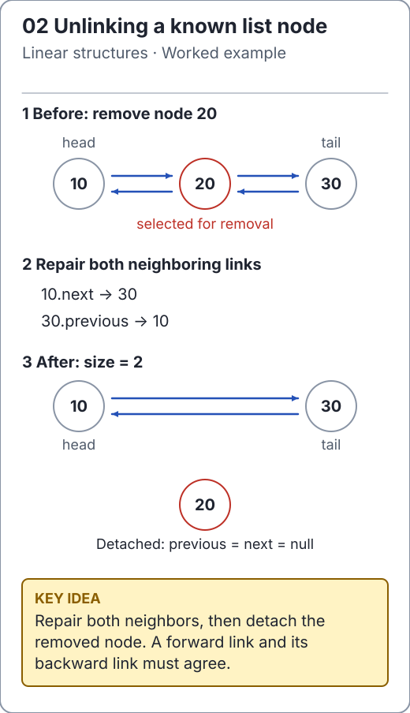</picture>

**Key idea:** Repair both neighbors, then detach the removed node. A forward link and its backward link must agree.

## 03. Stack: last in, first out

[Linear structures: read the lesson](../../data-structures/stacks/implementation.md)

<picture><source media="(prefers-color-scheme: dark)" srcset="assets/stack-lifo-dark.svg">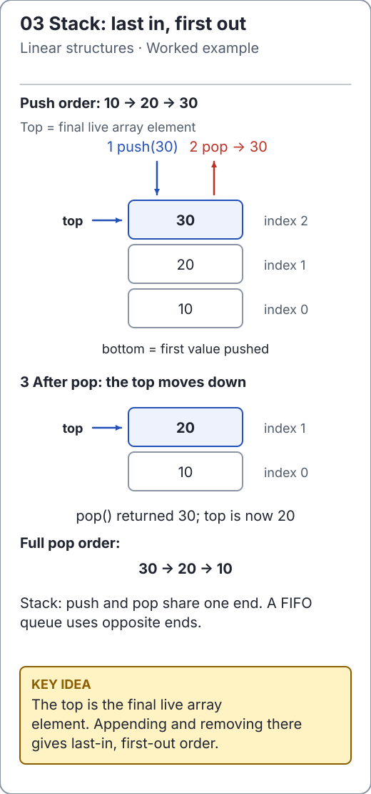</picture>

**Key idea:** The top is the final live array element. Appending and removing there gives last-in, first-out order.

## 04. Queue wrap: slots versus order

[Linear structures: read the lesson](../../data-structures/queues/implementation.md)

<picture><source media="(prefers-color-scheme: dark)" srcset="assets/queue-wrap-dark.svg">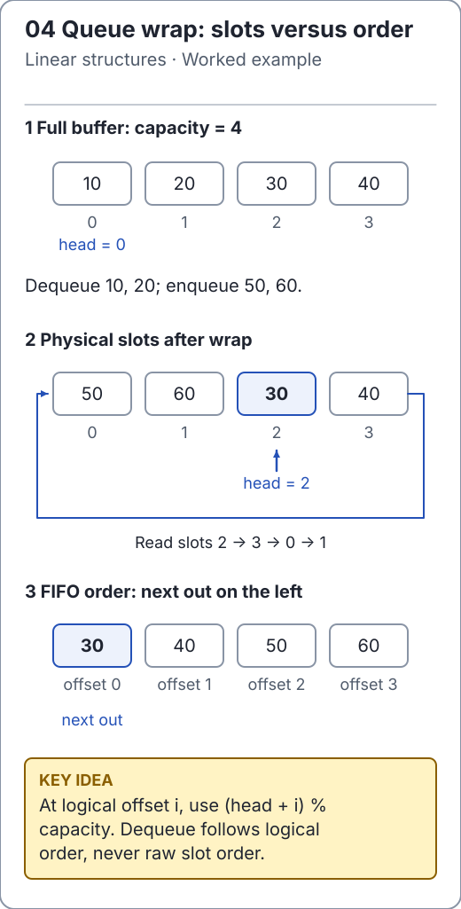</picture>

**Key idea:** At logical offset i, use (head + i) % capacity. Dequeue follows logical order, never raw slot order.

## 05. Hash collisions: keep both keys

[Linear structures: read the lesson](../../data-structures/hash-tables/collision-resolution.md)

<picture><source media="(prefers-color-scheme: dark)" srcset="assets/hash-chaining-dark.svg"></picture>

**Key idea:** A shared hash only selects a bucket. Equality still distinguishes the mappings; a collision must preserve both.

## 06. LRU: a hit changes the order

[Linear structures: read the lesson](../../data-structures/hash-tables/overview.md)

<picture><source media="(prefers-color-scheme: dark)" srcset="assets/lru-recency-dark.svg">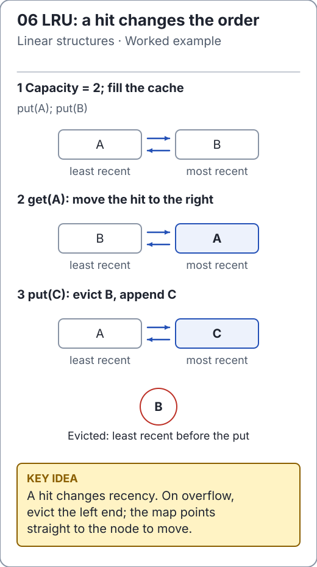</picture>

**Key idea:** A hit changes recency. On overflow, evict the left end; the map points straight to the node to move.

## 07. AVL rotation

[Trees and ranges: read the lesson](../../data-structures/trees/avl-trees.md)

<picture><source media="(prefers-color-scheme: dark)" srcset="assets/avl-rotation-dark.svg">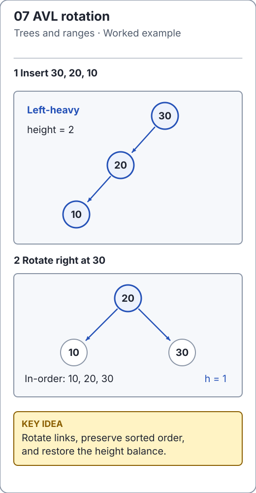</picture>

**Key idea:** Rotate links, preserve sorted order, and restore the height balance.

## 08. Heap: array and tree

[Trees and ranges: read the lesson](../../data-structures/heaps/overview.md)

<picture><source media="(prefers-color-scheme: dark)" srcset="assets/heap-anatomy-dark.svg">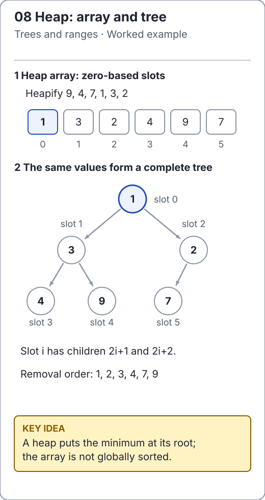</picture>

**Key idea:** A heap puts the minimum at its root; the array is not globally sorted.

## 09. Trie: preserve shared prefixes

[Trees and ranges: read the lesson](../../data-structures/tries/implementation.md)

<picture><source media="(prefers-color-scheme: dark)" srcset="assets/trie-pruning-dark.svg"></picture>

**Key idea:** Deleting a word clears its end marker. Keep nodes still needed by longer words.

## 10. Union-find components

[Trees and ranges: read the lesson](../../data-structures/trees/overview.md)

<picture><source media="(prefers-color-scheme: dark)" srcset="assets/union-find-dark.svg"></picture>

**Key idea:** Connectivity is a partition: five indices form two disjoint components.

## 11. Fenwick prefix blocks

[Trees and ranges: read the lesson](../../docs/solutions.md)

<picture><source media="(prefers-color-scheme: dark)" srcset="assets/fenwick-blocks-dark.svg"></picture>

**Key idea:** A prefix query combines disjoint blocks. The low bit gives each block's length.

## 12. Segment minimum

[Trees and ranges: read the lesson](../../data-structures/trees/overview.md)

<picture><source media="(prefers-color-scheme: dark)" srcset="assets/segment-minimum-dark.svg"></picture>

**Key idea:** Each node covers an adjacent interval. A point set repairs one path to the root.

## 13. Binary search: lower bound

[Algorithm traces: read the lesson](../../algorithms/searching/binary-search.md)

<picture><source media="(prefers-color-scheme: dark)" srcset="assets/binary-bound-dark.svg"></picture>

**Key idea:** Keep the first possible index inside [low, high]. A value at least the target moves high left, so duplicates cannot hide the first match.

## 14. Merge sort: split and combine

[Algorithm traces: read the lesson](../../algorithms/sorting/merge-sort.md)

<picture><source media="(prefers-color-scheme: dark)" srcset="assets/merge-recursion-dark.svg">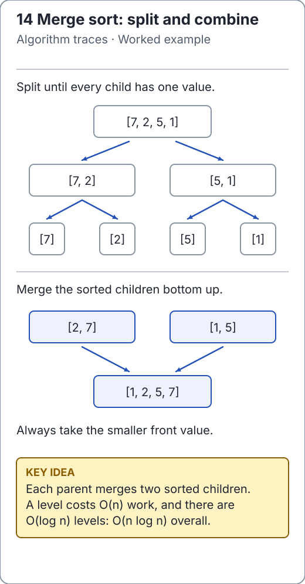</picture>

**Key idea:** Each parent merges two sorted children. A level costs O(n) work, and there are O(log n) levels: O(n log n) overall.

## 15. Quicksort: three-way partition

[Algorithm traces: read the lesson](../../algorithms/sorting/quick-sort.md)

<picture><source media="(prefers-color-scheme: dark)" srcset="assets/quick-partition-dark.svg">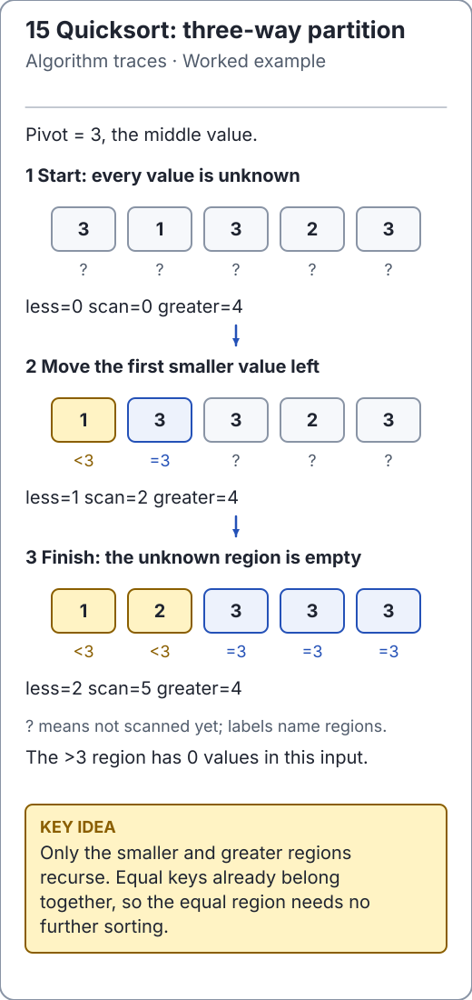</picture>

**Key idea:** Only the smaller and greater regions recurse. Equal keys already belong together, so the equal region needs no further sorting.

## 16. Coin change: build an optimum

[Algorithm traces: read the lesson](../../algorithms/dynamic-programming/problems.md)

<picture><source media="(prefers-color-scheme: dark)" srcset="assets/coin-dp-dark.svg">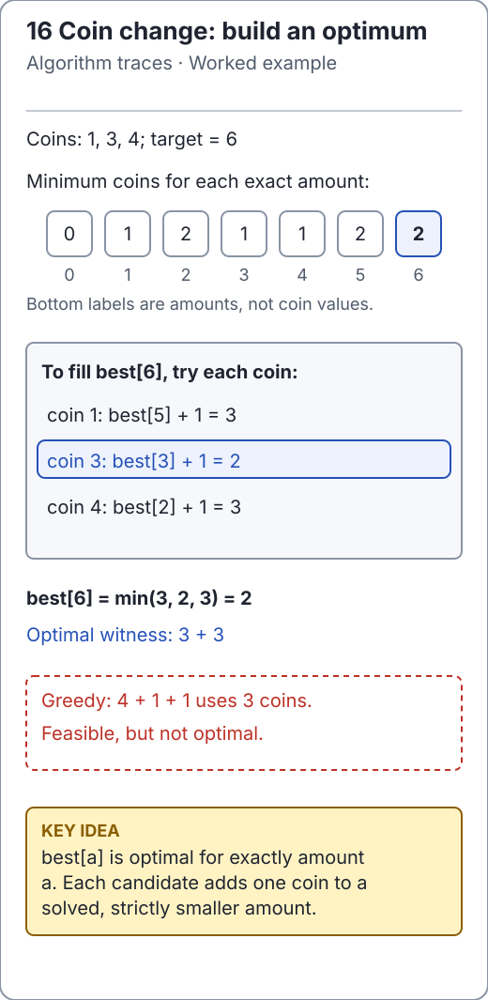</picture>

**Key idea:** best[a] is optimal for exactly amount a. Each candidate adds one coin to a solved, strictly smaller amount.

## 17. 0/1 knapsack: sweep backward

[Algorithm traces: read the lesson](../../algorithms/dynamic-programming/problems.md)

<picture><source media="(prefers-color-scheme: dark)" srcset="assets/knapsack-state-dark.svg"></picture>

**Key idea:** Descending capacity keeps the current item out of its own predecessor states. Each item is used at most once.

## 18. KMP: keep the overlap

[Algorithm traces: read the lesson](../../algorithms/searching/linear-search.md)

<picture><source media="(prefers-color-scheme: dark)" srcset="assets/kmp-overlap-dark.svg"></picture>

**Key idea:** After a match, retain the longest matched suffix that is also a pattern prefix. This preserves overlapping matches without rescanning text.

## 19. N-queens: reject and undo

[Algorithm traces: read the lesson](../../algorithms/backtracking/problems.md)

<picture><source media="(prefers-color-scheme: dark)" srcset="assets/queens-backtracking-dark.svg">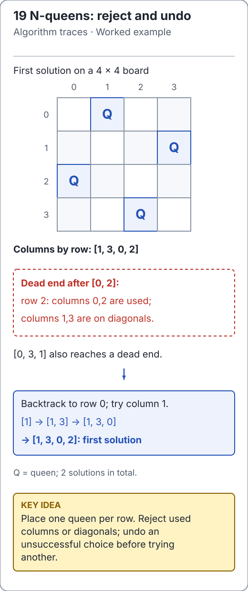</picture>

**Key idea:** Place one queen per row. Reject used columns or diagonals; undo an unsuccessful choice before trying another.

## 20. Greedy: finish first

[Algorithm traces: read the lesson](../../algorithms/greedy/overview.md)

<picture><source media="(prefers-color-scheme: dark)" srcset="assets/activity-selection-dark.svg">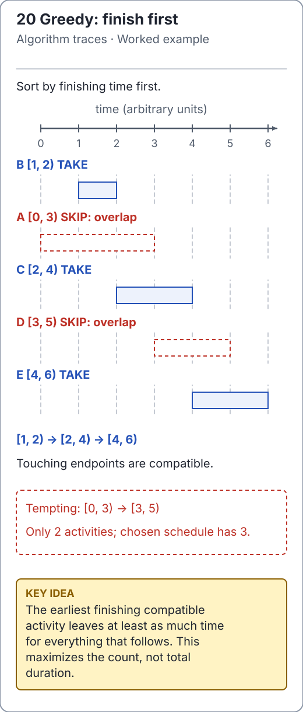</picture>

**Key idea:** The earliest finishing compatible activity leaves at least as much time for everything that follows. This maximizes the count, not total duration.

## 21. Bubble sort: adjacent swaps

[Algorithm traces: read the lesson](../../algorithms/sorting/bubble-sort.md)

<picture><source media="(prefers-color-scheme: dark)" srcset="assets/bubble-swaps-dark.svg">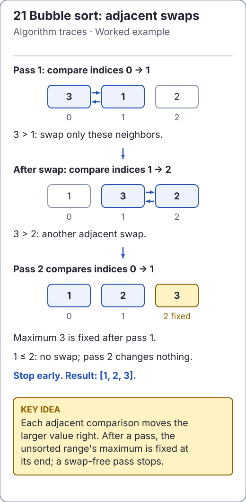</picture>

**Key idea:** Each adjacent comparison moves the larger value right. After a pass, the unsorted range's maximum is fixed at its end; a swap-free pass stops.

## 22. BFS: discovered vs processed

[Graphs: read the lesson](../../algorithms/graph/bfs.md)

<picture><source media="(prefers-color-scheme: dark)" srcset="assets/bfs-frontier-dark.svg">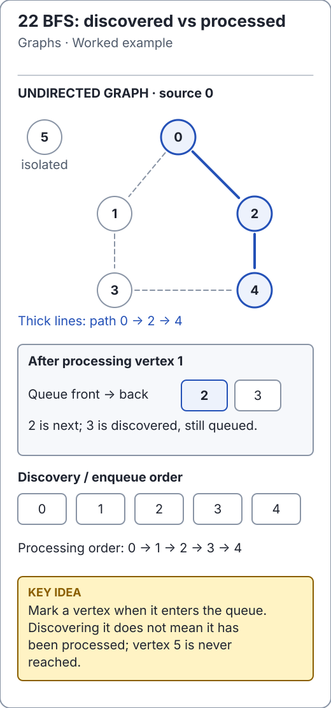</picture>

**Key idea:** Discovery happens on enqueue, before processing; isolated vertices stay unreachable.

## 23. Dijkstra: distance and path

[Graphs: read the lesson](../../algorithms/graph/bfs.md)

<picture><source media="(prefers-color-scheme: dark)" srcset="assets/dijkstra-path-dark.svg">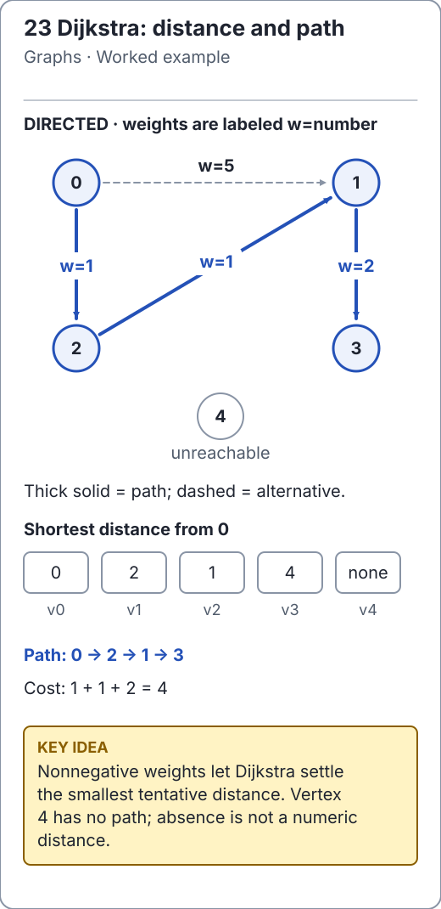</picture>

**Key idea:** Choose the cheapest weighted path; absence is separate from every numeric distance.

## 24. Negative edge or cycle?

[Graphs: read the lesson](../../algorithms/graph/bfs.md)

<picture><source media="(prefers-color-scheme: dark)" srcset="assets/bellman-negative-dark.svg">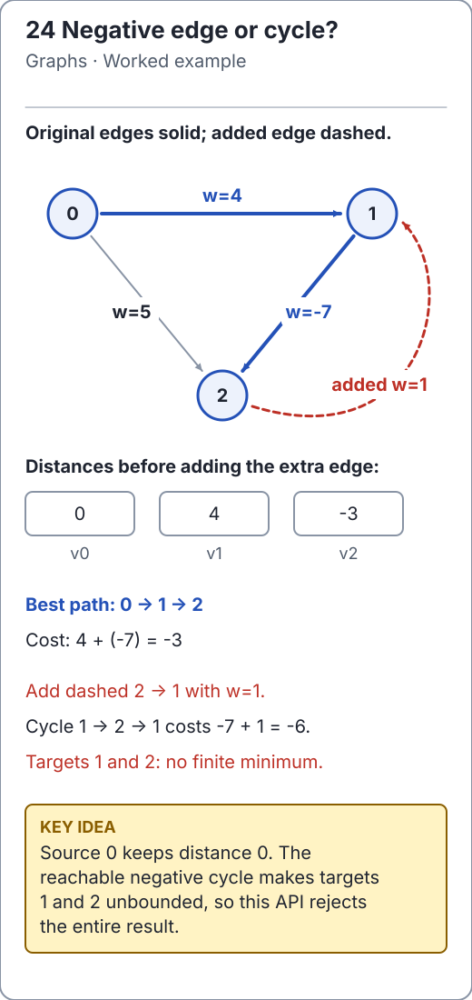</picture>

**Key idea:** A negative edge can be safe; this API rejects any reachable negative cycle.

## 25. SCCs and bridges differ

[Graphs: read the lesson](../../algorithms/graph/dfs.md)

<picture><source media="(prefers-color-scheme: dark)" srcset="assets/scc-bridges-dark.svg"></picture>

**Key idea:** SCCs test directed mutual reachability; bridges test an undirected edge's necessity.

## 26. Compare growth, not timings

[Complexity: read the lesson](../../complexity-analysis/time-complexity.md)

<picture><source media="(prefers-color-scheme: dark)" srcset="assets/complexity-growth-dark.svg">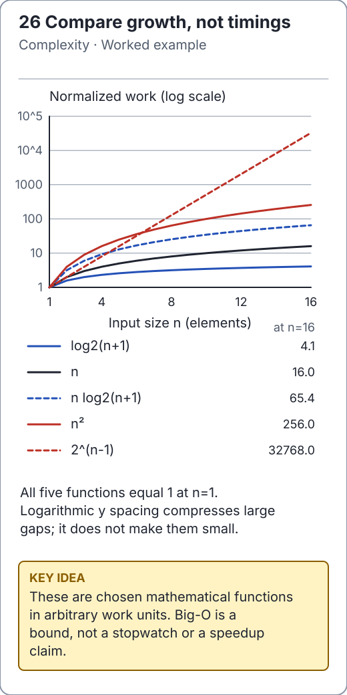</picture>

**Key idea:** Theoretical normalized work; constants, machines and measured runtime are outside this comparison.

## 27. Articulation points

[Graphs: read the lesson](../../algorithms/graph/graph-structure.md)

<picture><source media="(prefers-color-scheme: dark)" srcset="assets/articulation-points-dark.svg">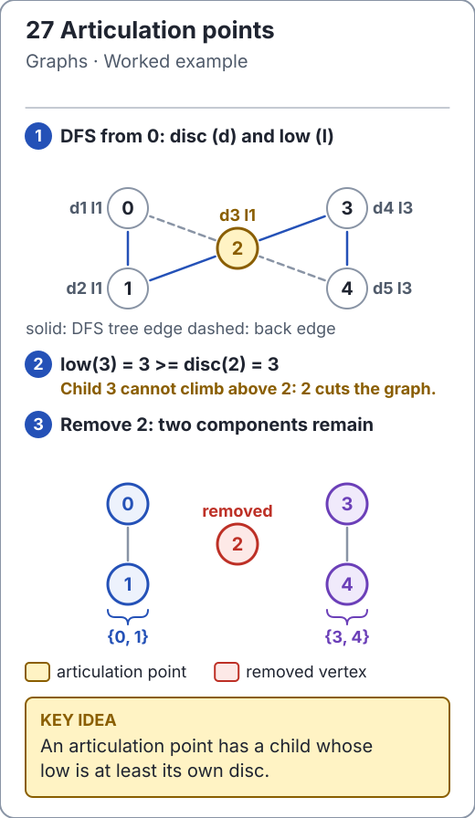</picture>

**Key idea:** An articulation point has a child whose low is at least its own disc.

## 28. Bipartite or odd cycle

[Graphs: read the lesson](../../algorithms/graph/graph-structure.md)

<picture><source media="(prefers-color-scheme: dark)" srcset="assets/bipartite-odd-cycle-dark.svg">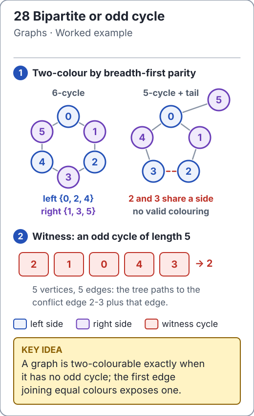</picture>

**Key idea:** A graph is two-colourable exactly when it has no odd cycle; the first edge joining equal colours exposes one.

## 29. Euler path

[Graphs: read the lesson](../../algorithms/graph/graph-structure.md)

<picture><source media="(prefers-color-scheme: dark)" srcset="assets/euler-path-dark.svg"></picture>

**Key idea:** Connected edges with zero or two odd-degree vertices give an Euler path.

## 30. Kruskal and Prim

[Graphs: read the lesson](../../algorithms/graph/minimum-spanning-trees.md)

<picture><source media="(prefers-color-scheme: dark)" srcset="assets/mst-kruskal-prim-dark.svg">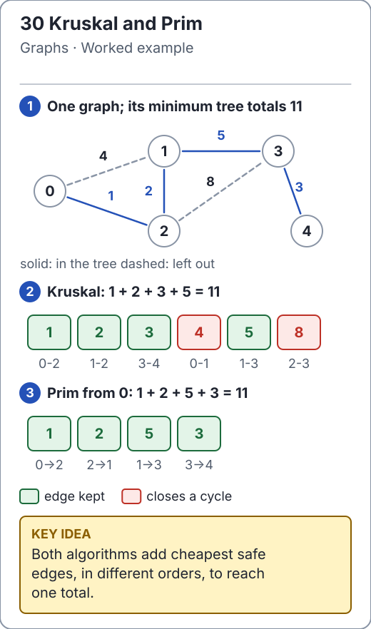</picture>

**Key idea:** Both algorithms add cheapest safe edges, in different orders, to reach one total.

## 31. Maximum flow and minimum cut

[Graphs: read the lesson](../../algorithms/graph/flows-and-matching.md)

<picture><source media="(prefers-color-scheme: dark)" srcset="assets/max-flow-min-cut-dark.svg">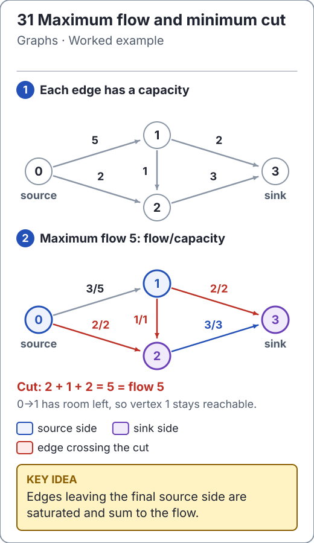</picture>

**Key idea:** Edges leaving the final source side are saturated and sum to the flow.

## 32. Augmenting a matching

[Graphs: read the lesson](../../algorithms/graph/flows-and-matching.md)

<picture><source media="(prefers-color-scheme: dark)" srcset="assets/matching-augmenting-path-dark.svg"></picture>

**Key idea:** Flipping one augmenting path grows a matching by exactly one pair.

## 33. Binary lifting for LCA

[Graphs: read the lesson](../../algorithms/graph/tree-queries.md)

<picture><source media="(prefers-color-scheme: dark)" srcset="assets/lca-binary-lifting-dark.svg">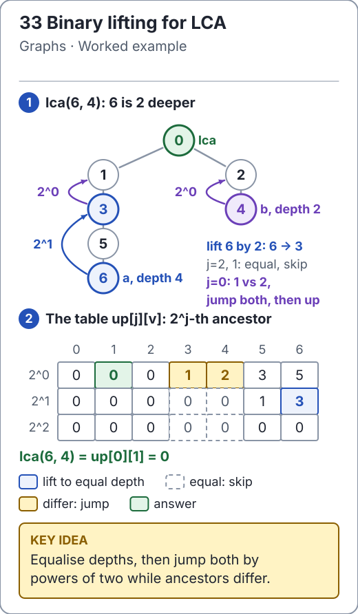</picture>

**Key idea:** Equalise depths, then jump both by powers of two while ancestors differ.

## 34. Tree diameter by two sweeps

[Graphs: read the lesson](../../algorithms/graph/tree-queries.md)

<picture><source media="(prefers-color-scheme: dark)" srcset="assets/tree-diameter-dark.svg"></picture>

**Key idea:** A sweep from any vertex ends at a diameter endpoint; sweep again from there.

## 35. Appending to a full array

[Linear structures: read the lesson](../../data-structures/arrays/operations.md)

<picture><source media="(prefers-color-scheme: dark)" srcset="assets/dynamic-array-growth-dark.svg">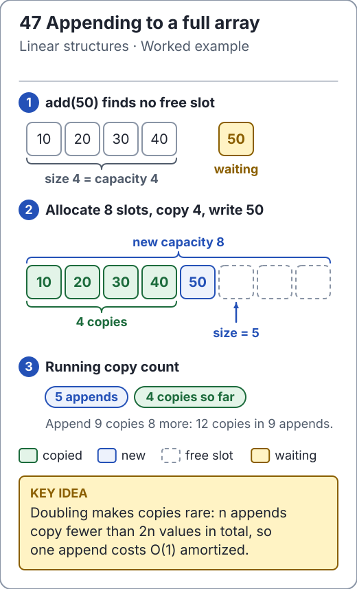</picture>

**Key idea:** Doubling makes copies rare: n appends copy fewer than 2n values in total, so one append costs O(1) amortized.

## 36. Insert after a known node

[Linear structures: read the lesson](../../data-structures/linked-lists/singly.md)

<picture><source media="(prefers-color-scheme: dark)" srcset="assets/singly-insert-after-dark.svg">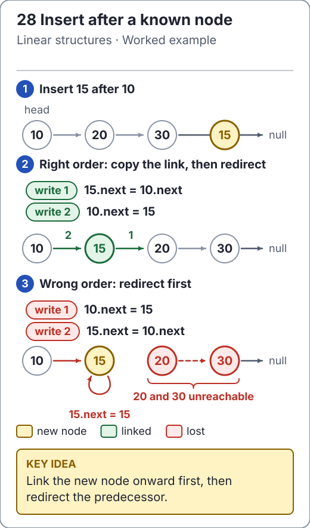</picture>

**Key idea:** Link the new node onward first, then redirect the predecessor.

## 37. Matching brackets with a stack

[Linear structures: read the lesson](../../data-structures/stacks/implementation.md)

<picture><source media="(prefers-color-scheme: dark)" srcset="assets/stack-bracket-matching-dark.svg"></picture>

**Key idea:** The stack holds exactly the unmatched openers; a closer must match the top.

## 38. A deque at both ends

[Linear structures: read the lesson](../../data-structures/queues/implementation.md)

<picture><source media="(prefers-color-scheme: dark)" srcset="assets/deque-both-ends-dark.svg">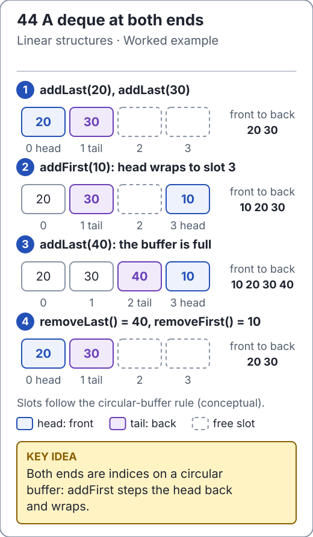</picture>

**Key idea:** Both ends are indices on a circular buffer: addFirst steps the head back and wraps.

## 39. Reaching index 5

[Linear structures: read the lesson](../../data-structures/arrays/overview.md)

<picture><source media="(prefers-color-scheme: dark)" srcset="assets/array-vs-list-access-dark.svg">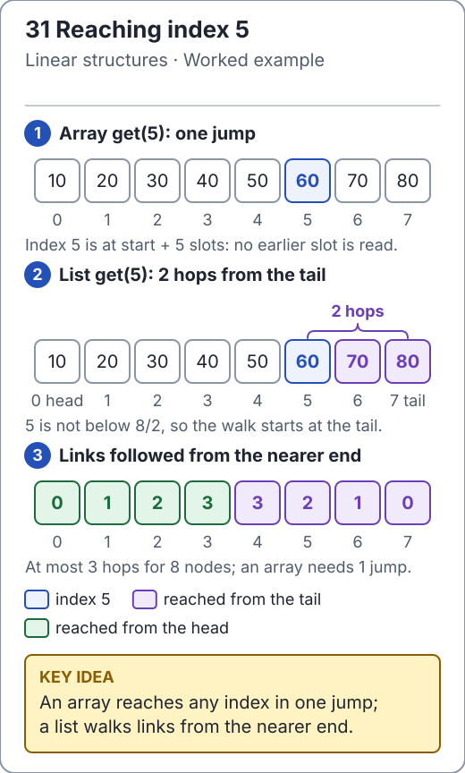</picture>

**Key idea:** An array reaches any index in one jump; a list walks links from the nearer end.

## 40. Four ways to walk a tree

[Trees and ranges: read the lesson](../../data-structures/trees/binary-trees.md)

<picture><source media="(prefers-color-scheme: dark)" srcset="assets/tree-traversals-dark.svg">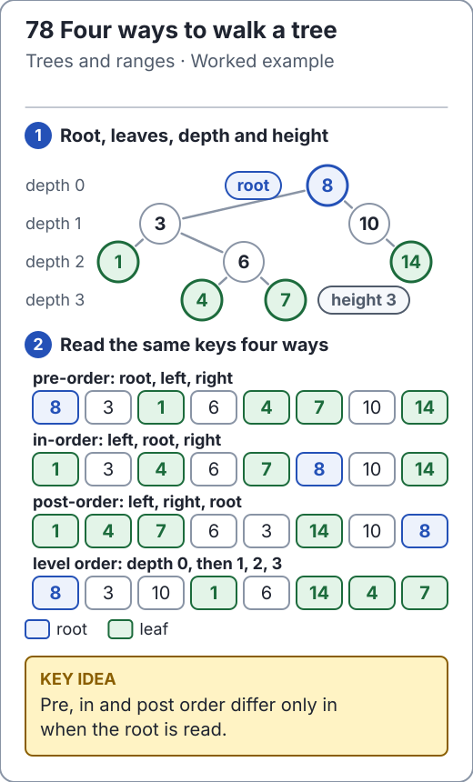</picture>

**Key idea:** Pre, in and post order differ only in when the root is read.

## 41. Delete with two children

[Trees and ranges: read the lesson](../../data-structures/trees/binary-search-trees.md)

<picture><source media="(prefers-color-scheme: dark)" srcset="assets/bst-delete-successor-dark.svg">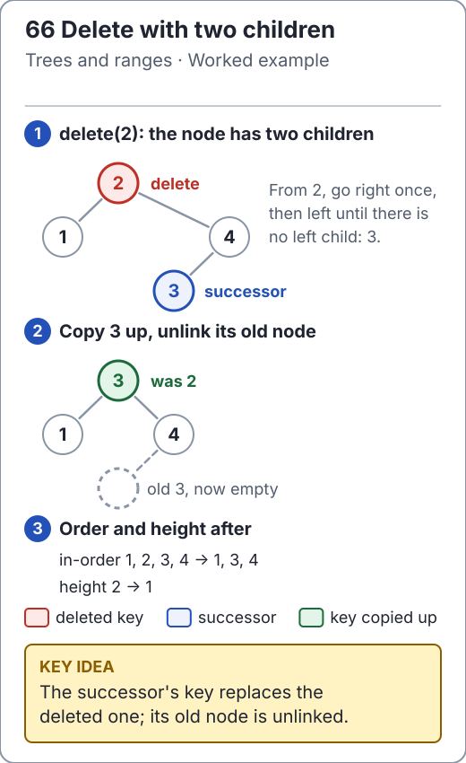</picture>

**Key idea:** The successor's key replaces the deleted one; its old node is unlinked.

## 42. Red links make 3-nodes

[Trees and ranges: read the lesson](../../data-structures/trees/red-black-trees.md)

<picture><source media="(prefers-color-scheme: dark)" srcset="assets/red-black-23-nodes-dark.svg">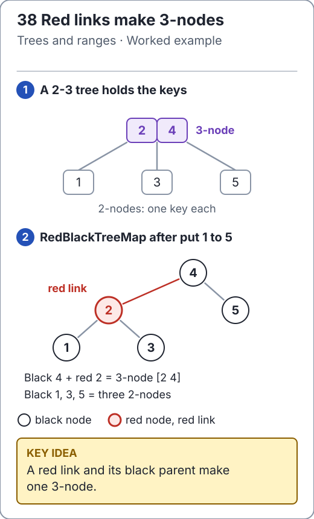</picture>

**Key idea:** A red link and its black parent make one 3-node.

## 43. Three local repairs

[Trees and ranges: read the lesson](../../data-structures/trees/red-black-trees.md)

<picture><source media="(prefers-color-scheme: dark)" srcset="assets/red-black-fixups-dark.svg">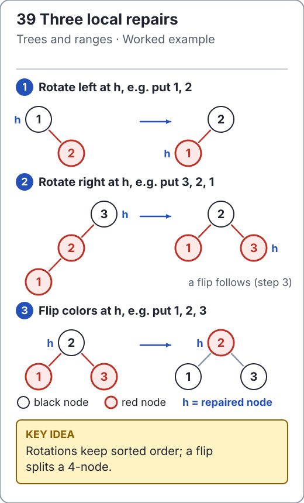</picture>

**Key idea:** Rotations keep sorted order; a flip splits a 4-node.

## 44. One insertion step

[Sorting and searching: read the lesson](../../algorithms/sorting/insertion-sort.md)

<picture><source media="(prefers-color-scheme: dark)" srcset="assets/insertion-sort-shift-dark.svg">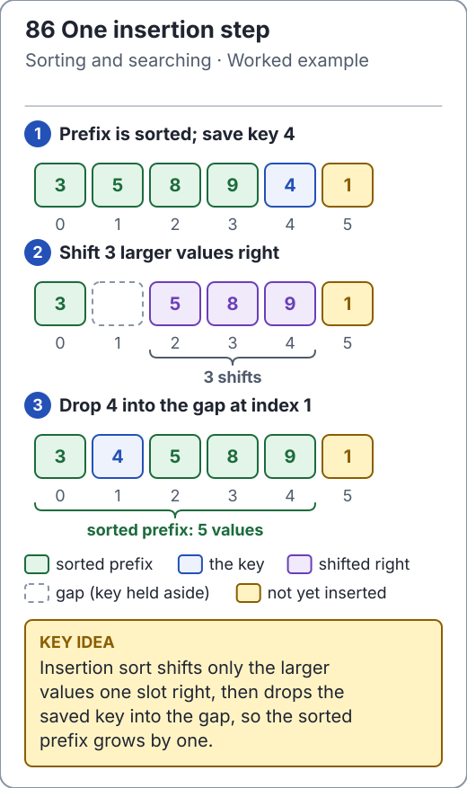</picture>

**Key idea:** Insertion sort shifts only the larger values one slot right, then drops the saved key into the gap, so the sorted prefix grows by one.

## 45. Heapsort phases

[Sorting and searching: read the lesson](../../algorithms/sorting/heap-sort.md)

<picture><source media="(prefers-color-scheme: dark)" srcset="assets/heapsort-phases-dark.svg">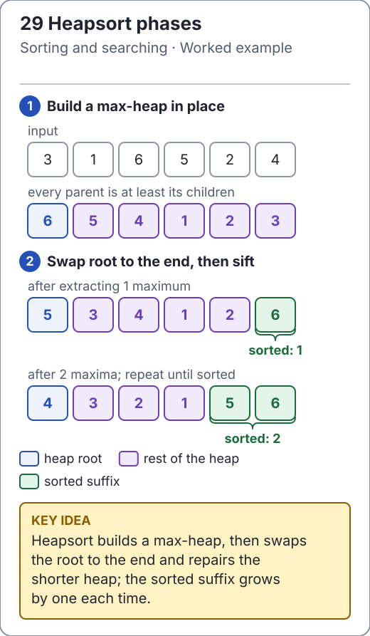</picture>

**Key idea:** Heapsort builds a max-heap, then swaps the root to the end and repairs the shorter heap; the sorted suffix grows by one each time.

## 46. Counting sort tally

[Sorting and searching: read the lesson](../../algorithms/sorting/non-comparison-and-comparator-sorts.md)

<picture><source media="(prefers-color-scheme: dark)" srcset="assets/counting-sort-counts-dark.svg">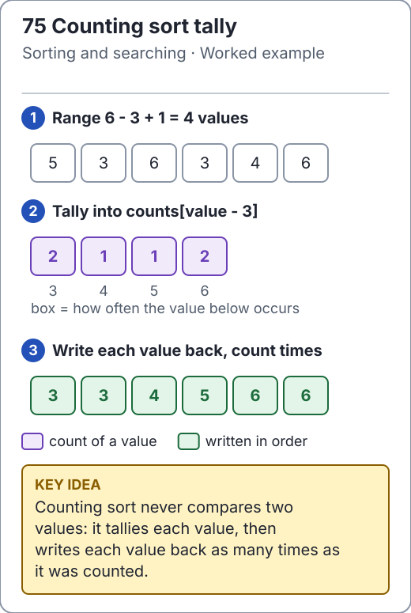</picture>

**Key idea:** Counting sort never compares two values: it tallies each value, then writes each value back as many times as it was counted.

## 47. Radix passes by digit

[Sorting and searching: read the lesson](../../algorithms/sorting/non-comparison-and-comparator-sorts.md)

<picture><source media="(prefers-color-scheme: dark)" srcset="assets/radix-lsd-passes-dark.svg"></picture>

**Key idea:** Radix sort orders by the least significant digit first; because every pass is stable, ties keep the earlier order and the last pass leaves a full sort.

## 48. Stable and unstable outcomes

[Sorting and searching: read the lesson](../../algorithms/sorting/non-comparison-and-comparator-sorts.md)

<picture><source media="(prefers-color-scheme: dark)" srcset="assets/sort-stability-dark.svg">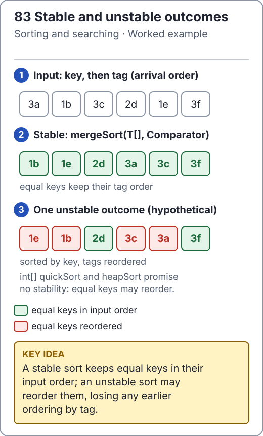</picture>

**Key idea:** A stable sort keeps equal keys in their input order; an unstable sort may reorder them, losing any earlier ordering by tag.
